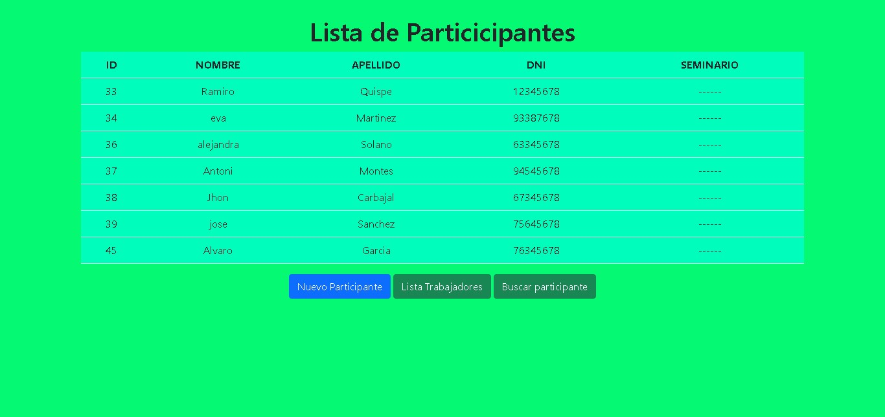
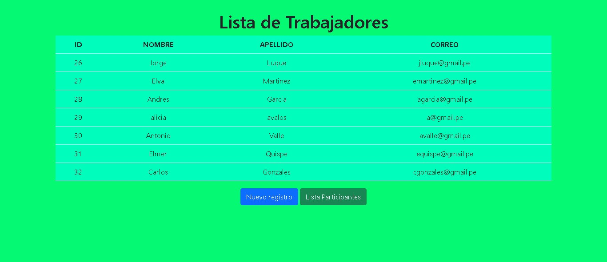
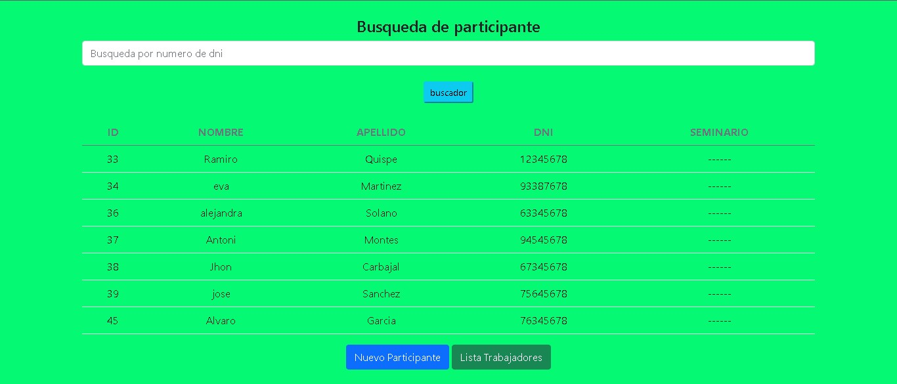

# **Jefer sc** 
## **Listado con php y bootstrap**
[Ver demo ->](https://github.com/jefersc/Listado_con_php.git)

## **Paginas Principales:**

 
<h1 align="center"><strong> 📝 Listado de Participantes:</strong></h1>
 

 
<h2 align="center"><strong> 📝 Listado de Trabajadores:</strong></h2>
 

 
<h2 align="center"><strong> 🆕 Nuevo Registro:</strong></h2>
 

 
<h2 align="center"><strong> 🆕 Nuevo Participante:</strong></h2>
 

 
<h2 align="center"><strong> 🔎 Buscar :</strong></h2>

  

  
